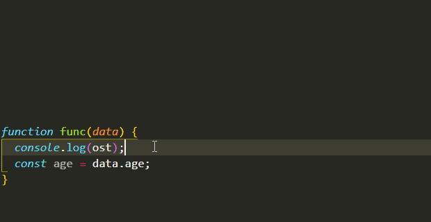

# Colored Console Log
 
Creates colored console.log messages for the browser.

> `Ctrl+L Ctrl+L` creates a colored message for primitive values

> `Ctrl+L Ctrl+O` creates a message for objects, prepending a colored ⧭ symbol to it
